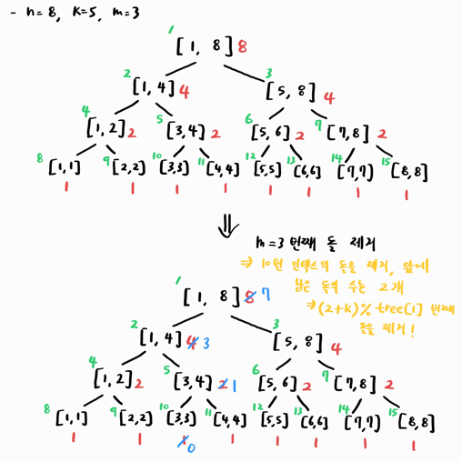

## [플5] 그리고 하나가 남았다 (3895번)

https://www.acmicpc.net/problem/3895

### 문제 유형

세그먼트 트리, 자료 구조, 정수론, 다이나믹 프로그래밍, 수학

<br>

### 어려웠던 점 / 문제의 핵심



구간의 합(돌의 개수)를 가진 세그먼트 트리를 구성한다. 잔여 돌의 수를 구하고 특정 인덱스에 위치한 돌을 제거하는 방식으로 문제를 접근한다.

k번째 돌이라는 것은 이전 단계에서 제거한 돌부터 시작해서 k만큼 건너 뛴 다음 위치에 있는 돌을 말하며, 이는 수식으로 표현하면 이전 단계에 남아있는 돌을 cnt라고 할 때 `(cnt + k) % total`이 된다.

돌은 각 위치에 한 개씩만 있기 때문에 특정 위치에 있는 돌을 제거하면, 해당 인덱스 앞에 있는 돌의 합은 사실상 현재 위치가 몇 번째 위치인지 아는 셈이다.

예를 들어 원형이지만 처음에 일렬로 따지면 8개 중 3번째 돌을 제거하면 앞에는 2개의 돌이 남아있고 우리의 현재 위치는 2번째인 셈이고, k번째를 건너 뛰어서 원형으로 돌을 제거해야 하기 때문에 (2 + k) % 남은 돌의 수로 모듈러 연산을 해주면 다음에 제거할 돌의 위치를 계산할 수 있다. 

이 때, 모듈러 연산의 결과가 0이면 0번째는 존재하지 않기 때문에, 마지막번째 돌을 제거해주면 된다.

처음에 세그먼트 트리를 초기화한 다음 m번째 돌을 제거하고 남은 개수와 함께 n - 1번 반복하면 되며, 마지막에 남은 인덱스가 찾으려고 하는 돌의 번호가 된다.

<br>

### 언어별 풀이 요약

| 언어   | 메모리   | 실행 시간(ms) | 시간복잡도 | 공간복잡도 | 풀이 시간 | 시도 횟수 | 해설 참고          |
| ------ | -------- | ------------- | ---------- | ---------- | --------- | --------- | ------------------ |
| Python |          |               |            |            |           |           |                    |
| Java   | 23096 KB | 236 ms        | O(NlogN)   | O(N)       | 40분      | 1         | :white_check_mark: |
| Kotlin |          |               |            |            |           |           |                    |

<br>

### 예외(테스트) 케이스

```
```

